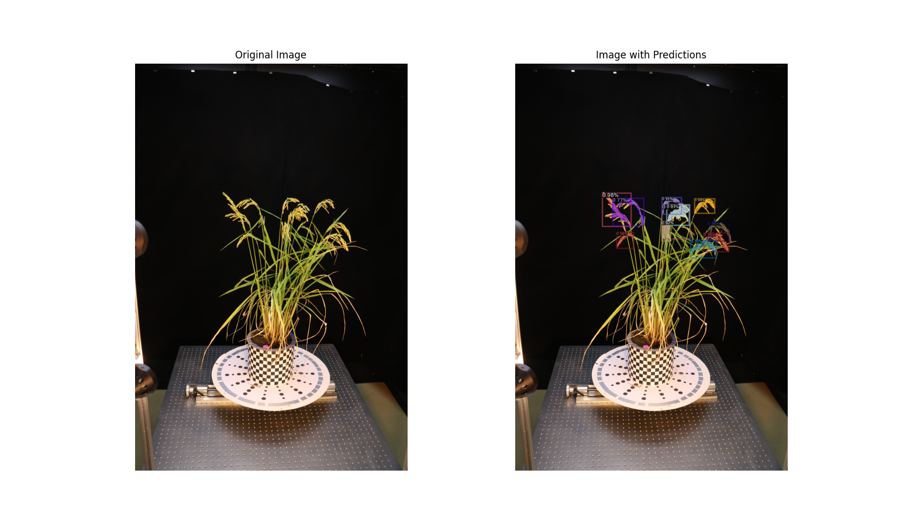
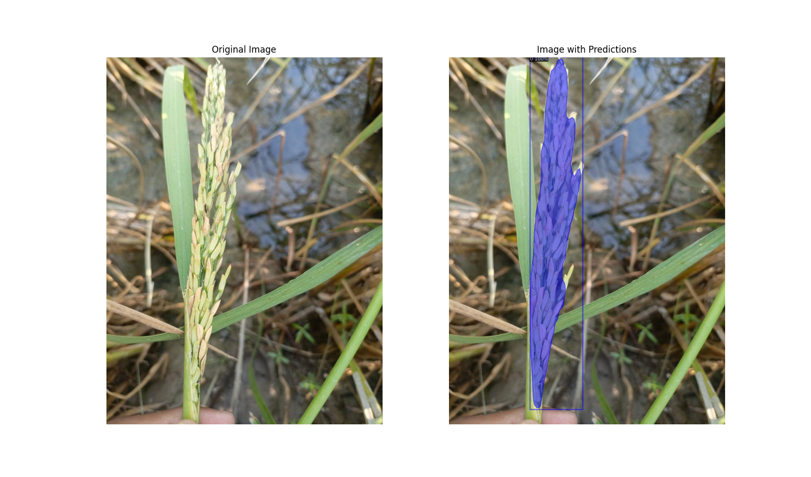
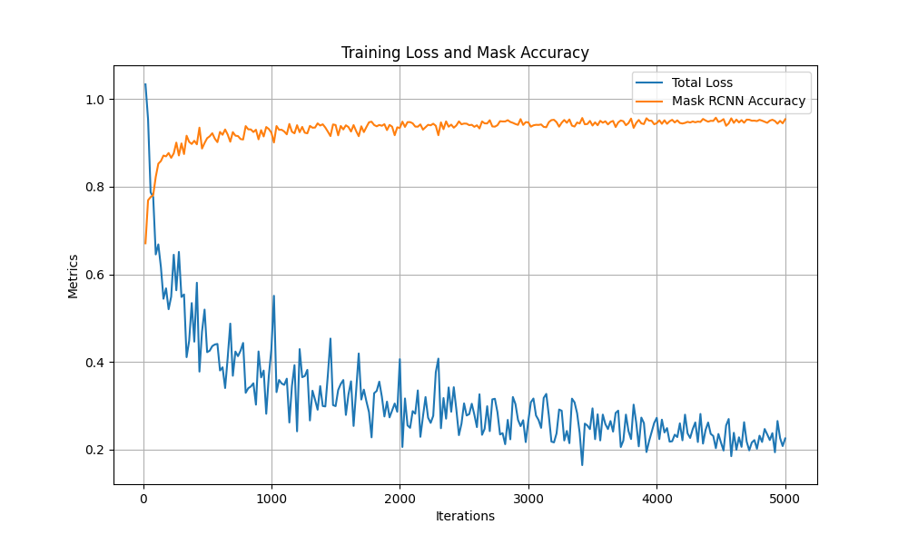
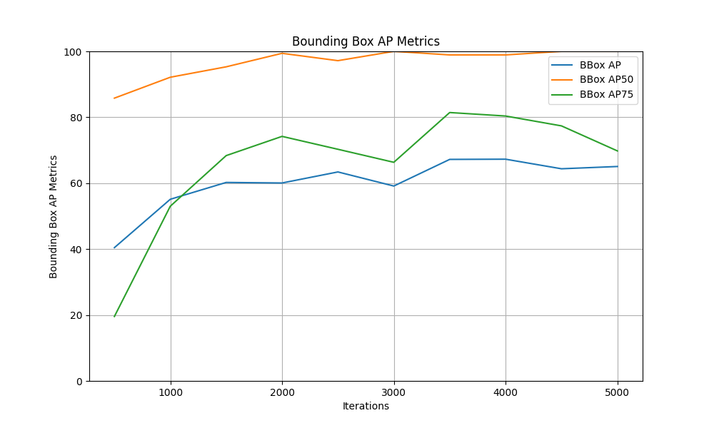
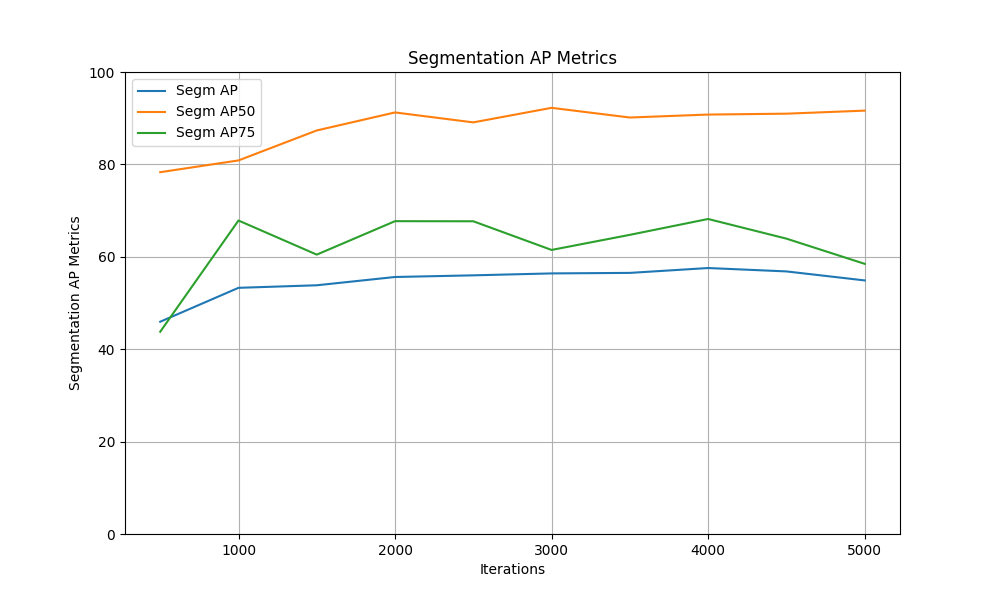

# Rice Panicle Instance Segmentation

## Project Introduction
This project focuses on **rice panicle instance segmentation**, aiming to detect and segment the boundaries of rice panicles from RGB image inputs. Using the **Detectron2** library with the Mask R-CNN architecture, this repository provides tools for training and inference to achieve precise segmentation.

**Rice Panicle Segmentation**:



For a detailed explanation of the methods and implementation, please refer to this [link](https://github.com/mhd-hanif/rice_panicle_instance_segmentation).

---

## How to Install & Setup

### Prerequisites
This tutorial is beginner-friendly and offers useful resources for setting up the Detectron2 library:

- [Detectron2 Setup Guide - Tutorial 1](https://www.youtube.com/watch?v=Pb3opEFP94U)
- [Detectron2 Basics - Tutorial 2](https://www.youtube.com/watch?v=ffTURA0JM1Q)
- [Detectron2 Training Workflow - Tutorial 3](https://www.youtube.com/watch?v=GoItxr16ae8)

### Steps to Install and Setup

1. **Install Detectron2**
   - Follow the instructions from the official Detectron2 GitHub repository: [Detectron2 GitHub](https://github.com/facebookresearch/detectron2).

2. **Clone This Repository**
   ```bash
   git clone https://github.com/mhd-hanif/rice_panicle_instance_segmentation.git
   cd rice_panicle_instance_segmentation
   ```

3. **Download the Dataset**
   - Download the datasets from [this link](https://drive.google.com/drive/folders/1YdZE4nLoY9pw7kZU8QaJJ4EPuR8n_HMo?usp=sharing).
   - Place the `wheat_head_dataset` and `rice_panicle_dataset` folders inside the `dataset` folder in this repository.

   Each dataset folder should have the following structure:
   ```
   dataset/
   ├── wheat_head_dataset/
   │   ├── train/
   │   ├── test/
   │   ├── val/
   │   ├── annotations/
   ├── rice_panicle_dataset/
   │   ├── train/
   │   ├── test/
   │   ├── val/
   │   ├── annotations/
   ```

4. **Download Trained Model Weights**
   - Download the pretrained models from [this link](https://drive.google.com/drive/folders/1YdZE4nLoY9pw7kZU8QaJJ4EPuR8n_HMo?usp=sharing).
   - Place the `M3` and `M4` model files into the `output` folder in this repository.

   #### Model Descriptions:
   - **M3 Model**: Trained exclusively on the `rice_panicle_dataset`.
   - **M4 Model**: First trained on the `wheat_head_dataset` and then fine-tuned on the `rice_panicle_dataset`.

   Each model folder should have the following structure:
   ```
   output/
   ├── M3/
   │   ├── inference/
   │   ├── metrics.json
   │   ├── model_final.pth
   ├── M4/
   │   ├── inference/
   │   ├── metrics.json
   │   ├── model_final.pth
   ```

### Directory Structure Example
After setting up the datasets and downloading the trained models, your directory should look like this:
```
rice_panicle_instance_segmentation/
│
├── dataset/
│   ├── wheat_head_dataset/
│   │   ├── train/
│   │   ├── test/
│   │   ├── val/
│   │   ├── annotations/
│   ├── rice_panicle_dataset/
│   │   ├── train/
│   │   ├── test/
│   │   ├── val/
│   │   ├── annotations/
│
├── output/
│   ├── M3/
│   │   ├── inference/
│   │   ├── metrics.json
│   │   ├── model_final.pth
│   ├── M4/
│   │   ├── inference/
│   │   ├── metrics.json
│   │   ├── model_final.pth
│
├── cfg/
│   │   ├── M3.pickle
│   │   ├── M4.pickle
├── labelme2coco.py
├── read_metrics.py
├── test.py
├── train.py
├── utils.py
├── README.md
└── ...
```
Your setup is now complete. Please refer to the next section to learn how to use the repository.

---

## How to Use

### 1. Training the Model
To train the model, run the following command:
```bash
python train.py
```
Before running the training script, ensure the following:
- Adjust the **dataset paths** and **pretrained weights path** inside `train.py` to match your setup.
- Set the **augmentation option** to `True` or `False` depending on your requirements.

### 2. Running Inference
To perform inference using a trained model, run the following command:
```bash
python test.py
```
Before running the inference script, ensure the following:
- Choose the desired **model** (e.g., M3 or M4) to use for inference by updating the weights path in `test.py`.
- Specify the **target image** to be segmented by updating the `image_path` in `test.py`.

### Pretrained Models
Two pretrained models are provided in the `output` folder:
- **M3 Model**: Trained exclusively on the `rice_panicle_dataset`.
- **M4 Model**: First trained on the `wheat_head_dataset` and then fine-tuned on the `rice_panicle_dataset`.

---

## Model Evaluation
The evaluation metrics for the **M4 Model** are as follows:

### Bounding Box Evaluation
- **bbox/AP50**: 98.9% (at IoU 50%, more lenient standard)
- **bbox/AP75**: 80.3% (stricter standard)
- **bbox/AP**: 67.2% (Overall average precision)

### Segmentation Evaluation
- **segm/AP50**: 91.6% (at IoU 50%, more lenient standard)
- **segm/AP75**: 63% (stricter standard)
- **segm/AP**: 58% (Overall average precision)

### Validation Plots
**Training Loss and Metrics Plot**:


**Bounding Box Metrics Plot**:


**Segmentation Metrics Plot**:


---

For additional details or to contribute to the project, feel free to explore or raise issues in this repository.

